# StablePay

[](https://github.com/Puneethkumarck/stablepay-hackathon/actions/workflows/ci.yml)
[](https://jdk.java.net/25/)
[](https://spring.io/projects/spring-boot)
[](https://stripe.com/)
[](https://solana.com/)
[](https://www.anchor-lang.com/)
[](https://go.dev/)

> **Instant cross-border remittances on Solana. No seed phrases. No app for recipients. Guaranteed delivery.**

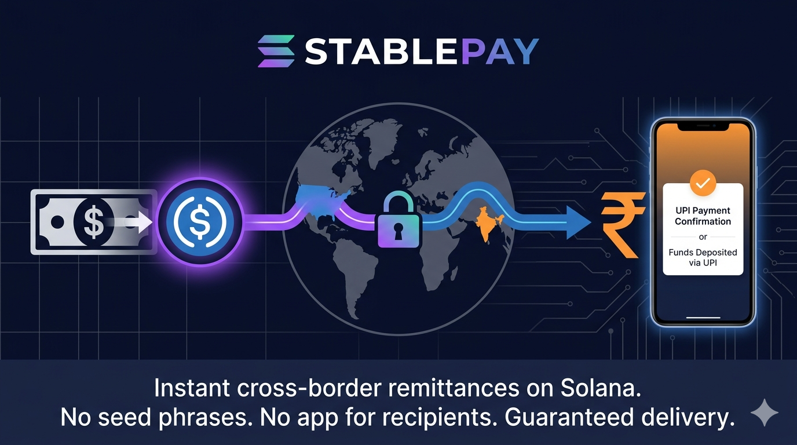

StablePay is a consumer-facing remittance application for the **USD → INR** corridor, built on USDC/Solana. It combines MPC wallet abstraction, a custom Anchor escrow program, and Temporal durable workflows to deliver a seamless sender-to-recipient experience — the recipient claims funds via an SMS link, no crypto knowledge required.

> Built for the [Colosseum Frontier Hackathon](https://www.colosseum.org/) (April 6 – May 11, 2026)

---

## The Problem We're Solving

```
Traditional Cross-Border Payment (USD → INR)

  US Sender           Correspondent       Correspondent       Indian
   Bank          →      Bank #1      →      Bank #2      →   Recipient
                                                               Bank
  ─────────────────────────────────────────────────────────────────────
  Day 0                Day 1-2             Day 2-3            Day 3-5

  Cost: 3-5% in fees + hidden FX spreads
  Time: 1-3 business days
```

```
StablePay (USD → INR) — E2E verified: 10/10 customers, 22-60s per remittance

  Google Login     StablePay API      Solana Escrow       Recipient
  (MPC Wallet) →  (Temporal WF)  →   (USDC PDA)     →   (SMS Claim)
  ─────────────────────────────────────────────────────────────────────
  0 sec            ~30 sec           ~1 min              Claim anytime

  Cost: < $0.01 on-chain fees
  Time: Sub-minute settlement, 48h claim window
```

---

## Architecture Overview

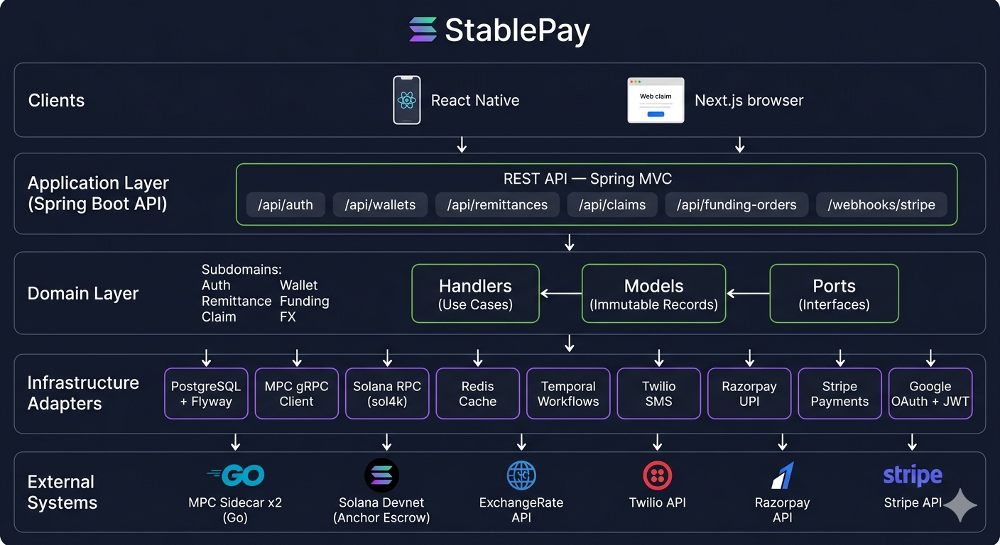

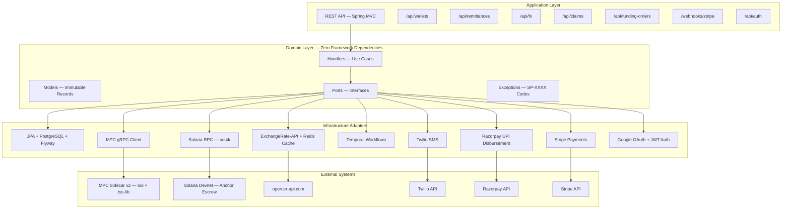

**Dependency rule:** `domain` → nothing. `application` → `domain`. `infrastructure` → `domain`. Never the reverse.

---

## The Payment Lifecycle: Step by Step

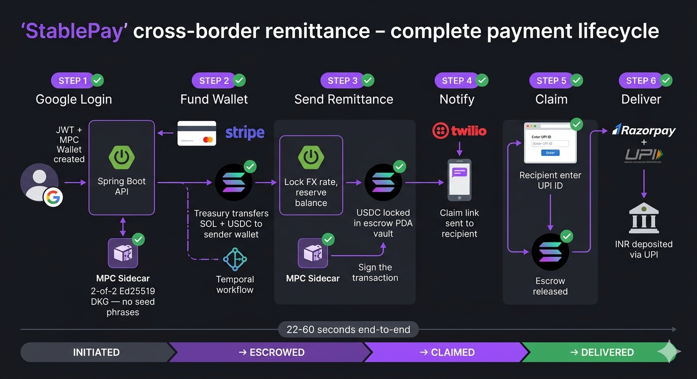

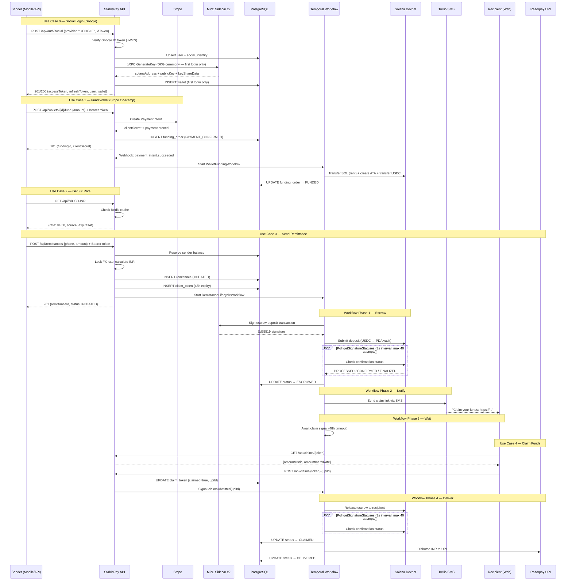

---

## Use Case 0: Social Login + Wallet Creation

> **Google sign-in, instant wallet.** On first login the backend verifies the Google ID token, creates a user record, and runs a 2-of-2 MPC DKG ceremony to produce an Ed25519 Solana wallet. No seed phrases. Returning users get their existing wallet.

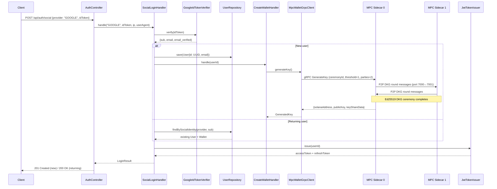

```
POST /api/auth/social
Content-Type: application/json

{ "provider": "GOOGLE", "idToken": "<google-id-token>" }
```

```json
{
  "accessToken": "<jwt>",
  "refreshToken": "<opaque-token>",
  "tokenType": "Bearer",
  "expiresIn": 900,
  "user": {
    "id": "7d4718ba-a6f3-485c-b89b-77afa2caf206",
    "email": "user@gmail.com"
  },
  "wallet": {
    "id": 16,
    "solanaAddress": "CrsMdkbkAQRz7srMgeTe9sanoiHkeQBCKnhhVR9DAd18",
    "availableBalance": 0,
    "totalBalance": 0,
    "createdAt": "2026-04-22T06:52:59.379393834Z",
    "updatedAt": "2026-04-22T06:52:59.379393834Z"
  }
}
```

### Additional Auth Endpoints

| Endpoint | Auth | Description |
|---|---|---|
| `POST /api/auth/refresh` | Public | Rotate refresh token, issue new access token |
| `POST /api/auth/logout` | Bearer JWT | Revoke all refresh tokens (204 No Content) |
| `GET /api/wallets/me` | Bearer JWT | Get authenticated user's wallet |

### What Happens Inside the MPC Sidecars

```
┌─────────────────────────────────────────────────────────────────┐
│                   MPC Key Generation (DKG)                       │
├─────────────────────────────────────────────────────────────────┤
│                                                                  │
│  1. Backend sends gRPC GenerateKey to Sidecar 0 (port 50051)    │
│                                                                  │
│  2. Sidecar 0 registers ceremony in P2P CeremonyRegistry        │
│     └─ Creates buffered channel for round messages               │
│                                                                  │
│  3. Both sidecars run tss-lib Ed25519 DKG protocol               │
│     ├─ Round 1: Commitment exchange (P2P port 7000↔7001)         │
│     ├─ Round 2: Share distribution                               │
│     └─ Round 3: Key derivation                                   │
│                                                                  │
│  4. Result: Both parties hold a key share                        │
│     ├─ Neither party has the full private key                    │
│     ├─ Public key (Ed25519) derived cooperatively                │
│     └─ Solana address = Base58(publicKey)                        │
│                                                                  │
│  5. Sidecar 0 returns to backend:                                │
│     ├─ solanaAddress: Base58-encoded Solana address              │
│     ├─ publicKey: Raw Ed25519 public key bytes                   │
│     └─ keyShareData: Serialized key share (stored in DB)         │
│                                                                  │
└─────────────────────────────────────────────────────────────────┘
```

### Error Paths

| Condition | Error Code | HTTP |
|---|---|---|
| User already has a wallet | SP-0008 | 409 Conflict |
| MPC ceremony fails | SP-0010 | 500 |
| gRPC timeout (>30s) | SP-0010 | 500 |

---

## Use Case 1: Fund Wallet (Stripe On-Ramp)

> **Real Stripe integration.** The sender pays via Stripe (card), which triggers a webhook. A Temporal workflow then transfers SOL (for rent/fees), creates an Associated Token Account, and transfers USDC from the treasury to the sender's MPC wallet on-chain.

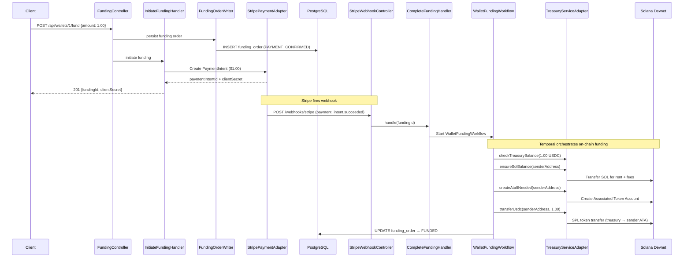

```
POST /api/wallets/1/fund
Content-Type: application/json

{ "amount": 1.00 }
```

```json
{
  "fundingId": "b2c8a29a-fcca-487f-979b-bf355c82faeb",
  "stripePaymentIntentId": "pi_3TO0YZ3nnME1dfOB0dz1SICr",
  "stripeClientSecret": "pi_...secret_...",
  "walletId": 1,
  "amountUsdc": 1.00,
  "status": "PAYMENT_CONFIRMED"
}
```

### Funding Order Status Machine

```
PAYMENT_CONFIRMED → FUNDED     (webhook + Temporal workflow succeeds)
PAYMENT_CONFIRMED → FAILED     (webhook: payment_intent.payment_failed)
FUNDED → REFUND_INITIATED      (manual refund)
REFUND_INITIATED → REFUNDED    (refund completed)
```

### Error Paths

| Condition | Error Code | HTTP |
|---|---|---|
| Wallet not found | SP-0006 | 404 |
| Treasury balance insufficient | SP-0007 | 503 |
| Funding already in progress for wallet | SP-0022 | 409 |
| Stripe PaymentIntent creation failed | SP-0021 | 502 |

---

## Use Case 2: Get FX Rate

> **Real-time rates with fallback.** FX rates come from ExchangeRate-API with Redis caching (5-minute TTL). If the API is unreachable, a hardcoded fallback rate of 84.50 is used.

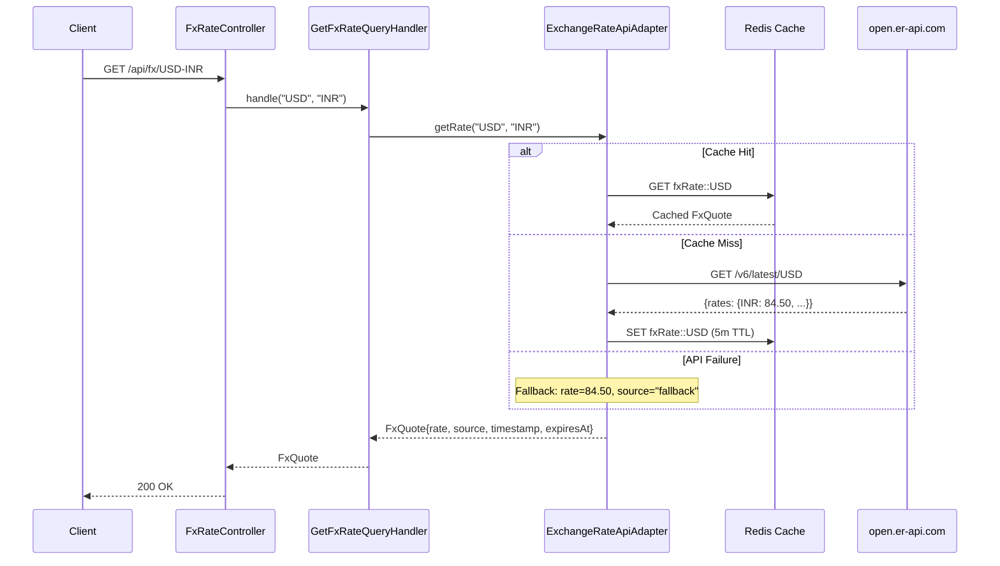

```
GET /api/fx/USD-INR
```

```json
{
  "rate": 84.500000,
  "source": "open.er-api.com",
  "timestamp": "2026-04-13T10:00:00Z",
  "expiresAt": "2026-04-13T10:01:00Z"
}
```

### Error Paths

| Condition | Error Code | HTTP |
|---|---|---|
| Unsupported corridor (e.g., EUR-INR) | SP-0009 | 400 |

---

## Use Case 3: Send Remittance

> **The core flow.** Reserves the sender's balance, locks the FX rate, generates a claim token, and starts a Temporal durable workflow that orchestrates the entire escrow-to-delivery lifecycle.

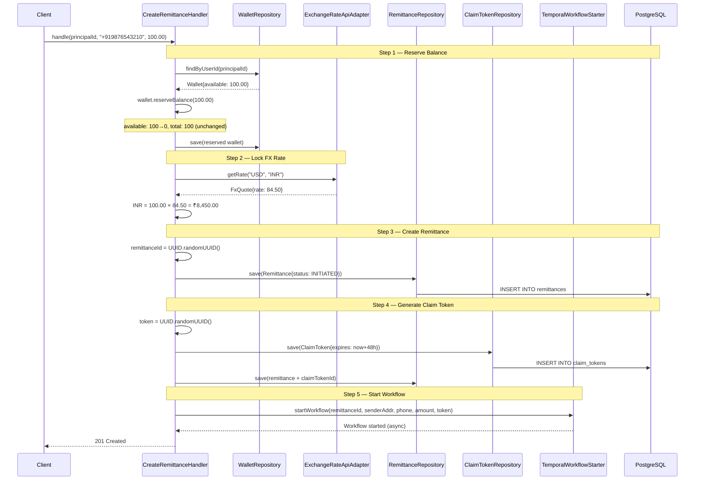

```
POST /api/remittances
Authorization: Bearer <jwt>
Content-Type: application/json

{
  "recipientPhone": "+919876543210",
  "amountUsdc": 1.00
}
```

```json
{
  "id": 10,
  "remittanceId": "8ce317d2-639e-4054-bcae-204706dc2c9a",
  "recipientPhone": "+919876543210",
  "amountUsdc": 1.0,
  "amountInr": 93.61,
  "fxRate": 93.605785,
  "status": "INITIATED",
  "escrowPda": null,
  "claimTokenId": "82a56560-ad6f-4b97-a26d-12c36b722f58",
  "smsNotificationFailed": false,
  "createdAt": "2026-04-22T06:53:15.632889681Z",
  "updatedAt": "2026-04-22T06:53:15.646040707Z",
  "expiresAt": null
}
```

### What Happens After the API Returns

The Temporal workflow takes over asynchronously. The sender gets an immediate response, and the workflow progresses through the escrow lifecycle in the background.

### Error Paths

| Condition | Error Code | HTTP |
|---|---|---|
| Sender wallet not found | SP-0006 | 404 |
| Insufficient balance | SP-0002 | 400 |
| Unsupported corridor | SP-0009 | 400 |

---

## Temporal Workflow: The Remittance Lifecycle

> **Guaranteed delivery.** If the process crashes at any point, Temporal resumes exactly where it left off. Every remittance reaches a terminal state — delivered, refunded, or failed.

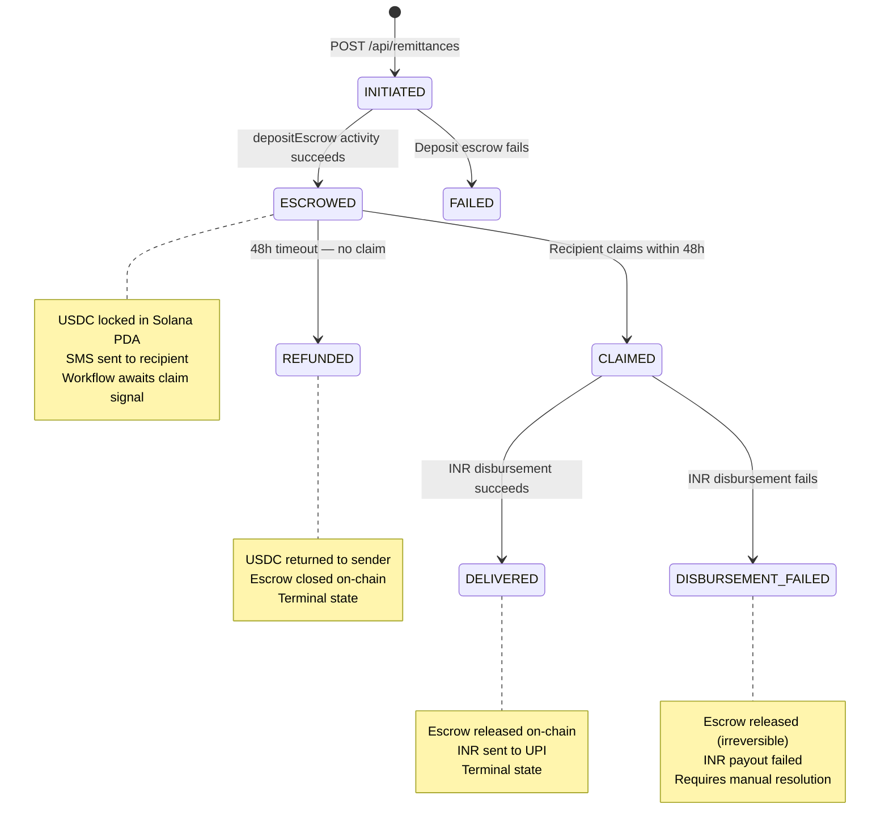

### Workflow Activities — In Execution Order

```
┌─────────────────────────────────────────────────────────────────┐
│              RemittanceLifecycleWorkflow.execute()                │
├─────────────────────────────────────────────────────────────────┤
│                                                                  │
│  Phase 1: ESCROW DEPOSIT                                         │
│  ├─ Activity: depositEscrow (60s timeout, 3 retries, 2s backoff)│
│  │   ├─ Fetch wallet's keyShareData from DB                     │
│  │   ├─ Build Solana escrow deposit instruction                  │
│  │   ├─ MPC-sign transaction (gRPC → sidecar)                   │
│  │   └─ Submit to Solana devnet → returns signature              │
│  ├─ Poll: awaitTransactionConfirmation(signature)                │
│  │   ├─ Calls getSignatureStatuses RPC every 3 seconds           │
│  │   ├─ Max 40 attempts (~120s total polling window)             │
│  │   ├─ Accepts CONFIRMED or FINALIZED as success                │
│  │   └─ Throws SP-0012 on timeout, SP-0031 on on-chain failure  │
│  └─ Status Update: INITIATED → ESCROWED                         │
│                                                                  │
│  Phase 2: SMS NOTIFICATION                                       │
│  ├─ Activity: sendClaimSms (30s timeout, 3 retries, 5s backoff) │
│  │   ├─ Build claim URL: {claimBaseUrl}/{claimToken}             │
│  │   └─ Send via Twilio (or log in dev mode)                     │
│  └─ On failure: set smsNotificationFailed=true, continue         │
│                                                                  │
│  Phase 3: AWAIT CLAIM                                            │
│  ├─ Workflow.await(48 hours, () -> claimReceived)                │
│  │                                                               │
│  │   ┌─ PATH A: Claim signal received ──────────────────────┐   │
│  │   │  Activity: releaseEscrow (60s, 3 retries, 2s backoff)│   │
│  │   │  Poll: awaitTransactionConfirmation (3s × 40 max)     │   │
│  │   │  Status Update: ESCROWED → CLAIMED                    │   │
│  │   │  Activity: disburseInr (45s, NO retry) via Razorpay   │   │
│  │   │  ├─ Success: Status → DELIVERED                       │   │
│  │   │  └─ Failure: Status → DISBURSEMENT_FAILED             │   │
│  │   └──────────────────────────────────────────────────────┘   │
│  │                                                               │
│  │   ┌─ PATH B: 48h timeout — no claim ────────────────────┐   │
│  │   │  Activity: refundEscrow (60s, 3 retries, 2s backoff) │   │
│  │   │  Poll: awaitTransactionConfirmation (3s × 40 max)     │   │
│  │   │  Status Update: ESCROWED → REFUNDED                   │   │
│  │   └──────────────────────────────────────────────────────┘   │
│  └                                                               │
│                                                                  │
└─────────────────────────────────────────────────────────────────┘
```

### Re-Sign on Retry

Solana blockhashes expire in ~60 seconds. If a deposit or release fails and retries, the workflow requests a **fresh MPC signature** with a new blockhash — it never replays a stale transaction.

### Disbursement Does Not Retry

Once escrow is released on-chain, the USDC is gone. If the INR disbursement fails after release, retrying could cause duplicate payouts. The workflow marks the status as `DISBURSEMENT_FAILED` for manual resolution.

---

## Use Case 4: Claim Funds (Recipient)

> **No app required.** The recipient opens an SMS link, sees how much they'll receive in INR, enters their UPI ID, and submits. The Temporal workflow wakes up and completes the delivery.

### Step 1: View Claim Details

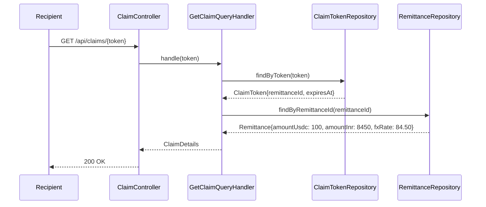

```
GET /api/claims/a1b2c3d4-token-uuid
```

### Step 2: Submit Claim with UPI ID

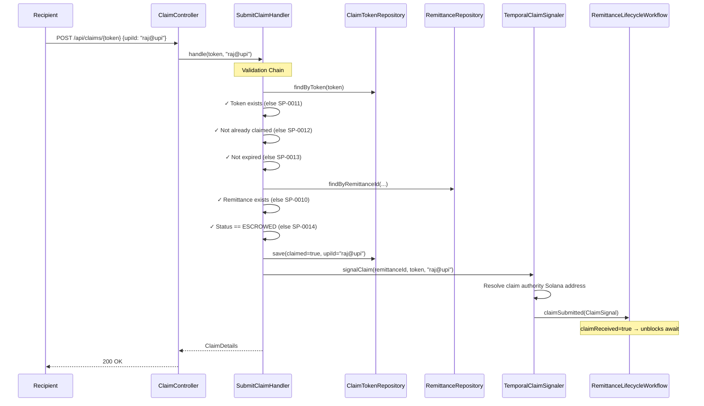

```
POST /api/claims/a1b2c3d4-token-uuid
Content-Type: application/json

{ "upiId": "raj@upi" }
```

### After the Signal: Workflow Completes Delivery

```
┌──────────────────────────────────────────────────────────────┐
│         What Happens After claimSubmitted Signal               │
├──────────────────────────────────────────────────────────────┤
│                                                                │
│  1. Workflow.await() unblocks (claimReceived = true)           │
│                                                                │
│  2. releaseEscrow activity                                     │
│     ├─ Build Solana claim instruction                          │
│     ├─ Transfer USDC from escrow PDA → destination address     │
│     ├─ Close vault token account (reclaim rent)                │
│     └─ Escrow status on-chain: Active → Claimed                │
│                                                                │
│  3. Status update: ESCROWED → CLAIMED                          │
│                                                                │
│  4. disburseInr activity                                       │
│     ├─ Call Razorpay Payout API                                │
│     ├─ Transfer INR to recipient's UPI ID                      │
│     └─ INR credited to recipient's bank via UPI                │
│                                                                │
│  5. Status update: CLAIMED → DELIVERED ✓                       │
│                                                                │
└──────────────────────────────────────────────────────────────┘
```

### Claim Validation Rules

| # | Check | Fails With | HTTP |
|---|---|---|---|
| 1 | Token exists in database | SP-0011 | 404 |
| 2 | Token not already claimed | SP-0012 | 409 |
| 3 | Token not expired (48h window) | SP-0013 | 410 |
| 4 | Remittance exists | SP-0010 | 404 |
| 5 | Remittance status is ESCROWED | SP-0014 | 409 |

---

## On-Chain Escrow Program

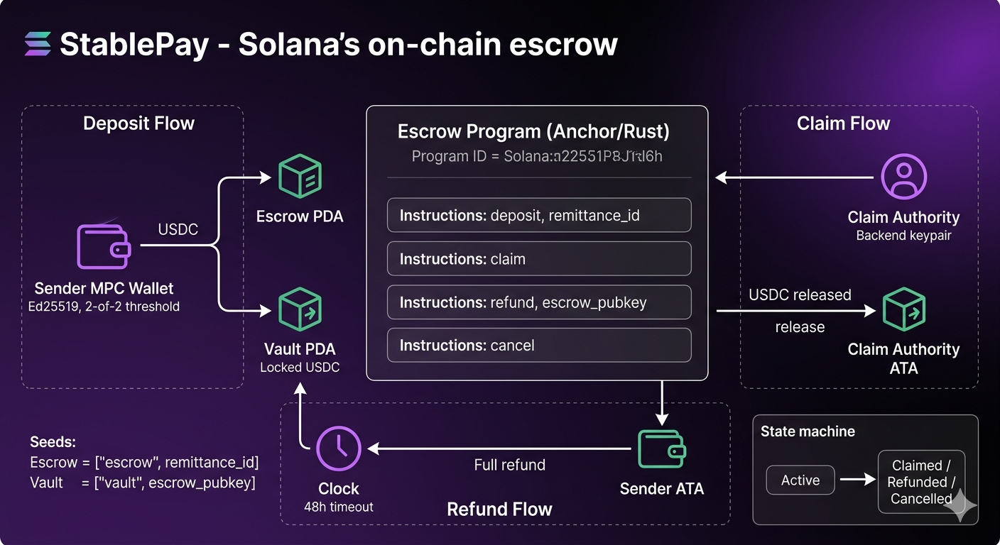

**Program ID:** `7C2zsbhgDnxQuC1Nd2rzXQfsfnKazQWFpoUJNqS8zWij`

Custom Anchor program managing USDC escrow on Solana devnet.

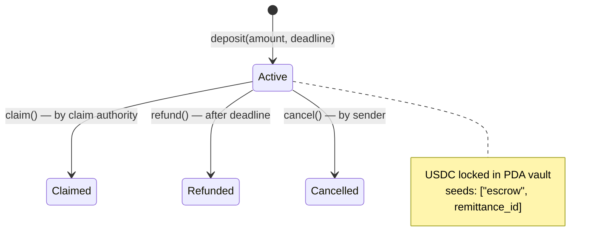

### Instructions

| Instruction | Caller | What It Does |
|---|---|---|
| `deposit(amount, deadline)` | Sender (MPC-signed) | Create escrow PDA, transfer USDC to vault, set 48h deadline |
| `claim()` | Backend (claim authority) | Transfer vault USDC to recipient, close accounts |
| `refund()` | Anyone (after deadline) | Return vault USDC to sender, close accounts |
| `cancel()` | Sender only | Return USDC before claim, close accounts |

### Escrow Account

```rust
pub struct Escrow {
    pub sender: Pubkey,           // Sender wallet (MPC-derived)
    pub claim_authority: Pubkey,  // Backend authority for claim
    pub mint: Pubkey,             // USDC mint address
    pub amount: u64,              // Locked amount (6 decimals)
    pub deadline: i64,            // Unix timestamp for refund eligibility
    pub status: EscrowStatus,     // Active | Claimed | Refunded | Cancelled
    pub bump: u8,                 // Canonical PDA bump
    pub remittance_id: Pubkey,    // Links on-chain to off-chain
}
```

### PDA Derivation

| Account | Seeds |
|---|---|
| Escrow | `["escrow", remittance_id]` |
| Vault | `["vault", escrow_pubkey]` |

---

## Solana Accounting Model

For a detailed visual walkthrough of every wallet, PDA, and token account involved in a remittance — from program deployment through escrow deposit, claim, and INR disbursement — see **[Solana Accounting Model](docs/SOLANA_ACCOUNTING_MODEL.md)**.

Covers: account types (wallets, ATAs, PDAs, mints), the full lifecycle of a $25 remittance (8 acts), final ledger state, the refund path, and why PDAs enable trustless escrow.

---

## Complete Error Code Reference

| Code | HTTP | Exception | Description |
|---|---|---|---|
| SP-0002 | 400 | InsufficientBalanceException | Wallet balance too low for remittance |
| SP-0003 | 400 | MethodArgumentNotValidException | Request validation failure |
| SP-0006 | 404 | WalletNotFoundException | Wallet not found by ID or userId |
| SP-0007 | 503 | TreasuryDepletedException | Treasury has insufficient funds |
| SP-0008 | 409 | WalletAlreadyExistsException | Wallet already exists for userId |
| SP-0009 | 400 | UnsupportedCorridorException | Currency pair not supported |
| SP-0010 | 404/500 | RemittanceNotFoundException / MpcKeyGenerationException | Remittance not found / MPC ceremony failed |
| SP-0011 | 404 | ClaimTokenNotFoundException | Claim token not found |
| SP-0012 | 409/500 | ClaimAlreadyClaimedException / SolanaTransactionException | Claim already submitted / TX confirmation timeout |
| SP-0013 | 410 | ClaimTokenExpiredException | Claim token past 48h expiry |
| SP-0014 | 409 | InvalidRemittanceStateException | Invalid state for operation |
| SP-0016 | 409 | InvalidRemittanceStateException | Invalid status transition |
| SP-0017 | 500 | SmsDeliveryException | SMS delivery failed |
| SP-0018 | 502 | DisbursementException | INR disbursement failed |
| SP-0020 | 404 | FundingOrderNotFoundException | Funding order not found |
| SP-0021 | 502 | FundingFailedException | Stripe payment / funding failed |
| SP-0022 | 409 | FundingAlreadyInProgressException | Funding already in progress for wallet |
| SP-0026 | 400 | InvalidWebhookSignatureException | Stripe webhook signature invalid |
| SP-0031 | 500 | SolanaTransactionException | Transaction failed on-chain |
| SP-0032 | 401 | InvalidIdTokenException | Invalid Google ID token |
| SP-0033 | 401 | EmailNotVerifiedException | Google email not verified |
| SP-0034 | 400 | UnsupportedAuthProviderException | Unsupported auth provider (only GOOGLE) |
| SP-0035 | 401 | InvalidRefreshTokenException | Invalid refresh token |
| SP-0036 | 401 | RefreshTokenExpiredException | Refresh token expired |
| SP-0040 | 401 | SecurityAuthenticationEntryPoint | Authentication required (missing/invalid JWT) |

---

## Quick Start

### Prerequisites

- Java 25 (`sdk install java 25-tem`)
- Docker + Docker Compose
- Go 1.26 (for MPC sidecar)
- Solana CLI 2.2.7 + Anchor CLI 0.32.1 (for on-chain program)
- Node.js 22+ (for Anchor tests)

### Full Stack (Docker Compose)

```bash
make up
```

```
============================================
  StablePay Dev Stack
============================================
  Backend API:    http://localhost:8080
  Swagger UI:     http://localhost:8080/swagger-ui.html
  Health:         http://localhost:8080/actuator/health
  Temporal UI:    http://localhost:8088
  PostgreSQL:     localhost:5432
  Redis:          localhost:6379
  MPC Sidecar 0:  localhost:50051 (gRPC)
  MPC Sidecar 1:  localhost:50052 (gRPC)
============================================
```

### Infrastructure Only (Local Backend Dev)

```bash
make infra
cd backend && ./gradlew bootRun
```

### Individual Components

```bash
# Backend — compile + format + all tests
cd backend && ./gradlew build

# Anchor program
anchor build && anchor test

# MPC sidecar
cd mpc-sidecar && go build ./... && go test ./... -v -count=1 -timeout 120s
```

### Makefile Targets

| Target | Description |
|---|---|
| `make up` | Build backend + start full Docker Compose stack (8 services) |
| `make down` | Stop all services |
| `make infra` | Start infrastructure only (for local backend dev) |
| `make logs` | Follow Docker Compose logs |
| `make clean` | Stop all services and remove volumes |

### Try the API

A Postman collection is available at [`docs/StablePay.postman_collection.json`](docs/StablePay.postman_collection.json).

Interactive Swagger UI: http://localhost:8080/swagger-ui.html

---

## Testing

```bash
# Backend: all tests + formatting
cd backend && ./gradlew build

# Unit tests only
cd backend && ./gradlew test

# Integration tests with TestContainers
cd backend && ./gradlew integrationTest

# Anchor program tests (799 lines, TypeScript on localnet)
anchor test

# MPC sidecar tests
cd mpc-sidecar && go test ./... -v -count=1 -timeout 120s
```

### CI Pipeline

GitHub Actions runs **7 jobs** on every push to `main` and every PR:

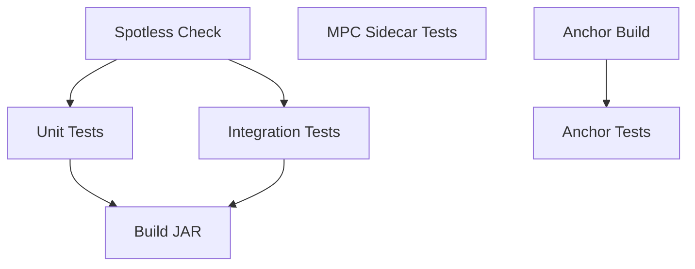

---

## Tech Stack

| Component | Technology |
|---|---|
| Backend | Java 25, Spring Boot 4.0.5, Spring MVC, JPA |
| Database | PostgreSQL 18, Flyway 12.3 |
| Cache | Redis 8 |
| Workflows | Temporal 1.29.5 (SDK 1.34.0) |
| On-chain | Rust, Anchor 0.32.1, Solana 2.2.7 (devnet) |
| MPC | Go 1.26, bnb-chain/tss-lib (fystack fork) |
| Solana SDK | sol4k 0.7.0 |
| On-ramp | Stripe (card payments + webhooks) |
| Off-ramp | Razorpay UPI Payouts |
| SMS | Twilio 11.3.6 |
| Mapping | MapStruct 1.6.3 |
| Resilience | Resilience4j 2.3.0 |
| API Docs | springdoc-openapi 3.0.2 |
| Build | Gradle 9.4.1 (Kotlin DSL), Jib |
| Testing | JUnit 5, BDDMockito, AssertJ, ArchUnit 1.4.1, TestContainers 1.21.4 |
| CI | GitHub Actions (7 jobs) |

---

## Project Structure

```
stablepay-hackathon/
├── backend/                          # Spring Boot API
│   └── src/
│       ├── main/java/com/stablepay/
│       │   ├── application/          # Controllers, DTOs, config
│       │   ├── domain/               # Models, handlers, ports
│       │   │   ├── auth/             #   Social login, JWT, refresh tokens
│       │   │   ├── wallet/           #   MPC wallet management
│       │   │   ├── remittance/       #   Core remittance flow
│       │   │   ├── funding/          #   Stripe funding orders
│       │   │   ├── claim/            #   SMS claim tokens
│       │   │   ├── fx/               #   FX rate quotes
│       │   │   └── common/           #   Shared ports (SMS, disbursement)
│       │   └── infrastructure/       # Adapters
│       │       ├── db/               #   JPA + Flyway (8 migrations)
│       │       ├── auth/             #   Google ID token verifier + JWT issuer
│       │       ├── temporal/         #   Workflows + activities
│       │       ├── mpc/              #   gRPC client to sidecars
│       │       ├── solana/           #   RPC + escrow instruction builder + tx confirmation
│       │       ├── stripe/           #   Stripe payments + webhook verification
│       │       ├── razorpay/         #   Razorpay UPI disbursement
│       │       ├── fx/               #   ExchangeRate-API + Redis cache
│       │       └── sms/              #   Twilio + logging fallback
│       ├── test/                     # 65 unit test files
│       └── integration-test/         # 23 integration test files
├── programs/stablepay-escrow/        # Anchor program (Rust)
│   └── src/
│       ├── lib.rs                    # 4 instructions
│       ├── instructions/             # deposit, claim, refund, cancel
│       ├── state/                    # Escrow account + EscrowStatus enum
│       ├── errors.rs                 # 10 custom error codes
│       └── constants.rs              # PDA seeds
├── mpc-sidecar/                      # MPC threshold signing (Go)
│   ├── cmd/sidecar/                  # Entry point
│   ├── internal/
│   │   ├── tss/                      # DKG + Ed25519 signing
│   │   ├── p2p/                      # Ceremony registry + TCP coordination
│   │   ├── server/                   # gRPC (GenerateKey, Sign, HealthCheck)
│   │   └── config/                   # Environment-based config
│   └── proto/                        # Protobuf definitions (sidecar + p2p)
├── tests/                            # Anchor E2E tests (TypeScript, 799 lines)
├── docs/                             # Architecture, standards, ADRs
├── docker-compose.yml                # 8 services
├── Makefile                          # Build + orchestration
└── Anchor.toml
```

---

## Contributing

All work goes through feature branches and pull requests. Never commit directly to `main`.

```bash
git checkout -b feature/STA-42-add-claim-page
cd backend && ./gradlew build
git push -u origin feature/STA-42-add-claim-page
gh pr create --title "STA-42: Add claim page"
```

Branch naming: `feature/STA-{N}-description` · Commit messages: `feat(STA-{N}): description`
