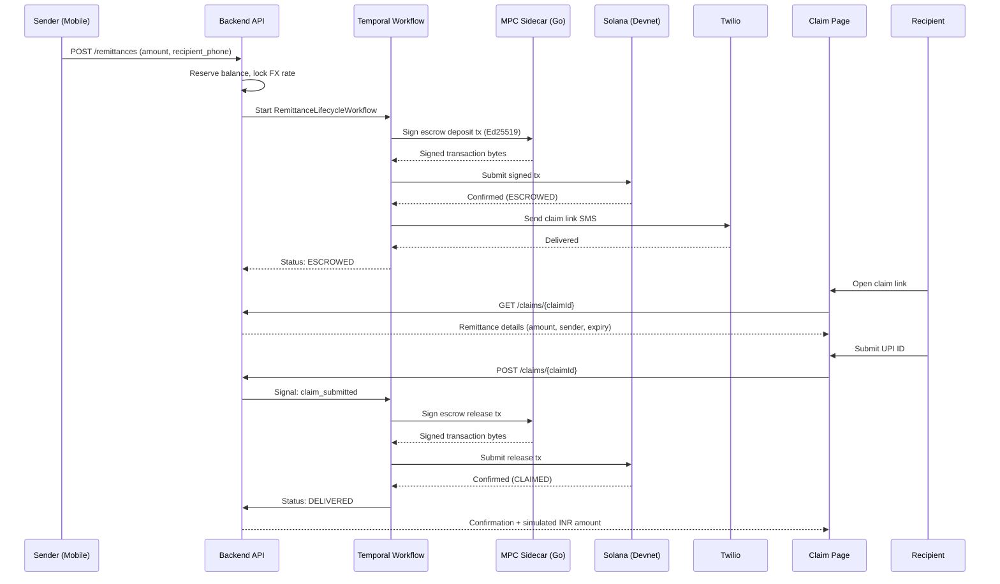

# feat: Cross-border USD→INR remittance on Solana

## Overview

Build StablePay — a cross-border remittance app for the USD→INR corridor on Solana — for the Colosseum Frontier Hackathon (April 6 – May 11, 2026). The system combines a custom Anchor escrow program, MPC wallet abstraction (Ed25519 via forked mpcium), Temporal remittance lifecycle workflows, a React Native sender app, and a web-based recipient claim page. Five existing production projects provide reusable patterns and code.

## Problem Frame

Indian diaspora in the US (18M people) send $125B annually to India through slow, expensive channels. StablePay uses USDC on Solana to settle in seconds for <$0.01. The triple differentiator vs Credible Finance (C4 accelerator): guaranteed delivery (tx-recovery state machine), wallet abstraction (real MPC, not custodial), and frictionless claiming (recipient opens a link, no app/wallet needed). (see origin: `docs/brainstorms/2026-04-03-stablepay-cross-border-requirements.md`)

## Requirements Trace

**P0 — Must-Have for Demo:**
- R1. MPC wallet created silently on signup (Ed25519 threshold via forked mpcium)
- R2. Devnet USDC from pre-funded treasury to sender wallet (via "demo fund" endpoint). Stripe ACH on-ramp is P1.
- R3. Send flow with FX rate lock at app confirmation
- R4. USDC locked in Anchor escrow PDA, signed by MPC wallet
- R5. Real-time in-app status (polling GET /remittances/{id} every 3s). Structurally required for demo.
- R6. SMS claim link via Twilio
- R7/R8/R9. Web claim page: show amount, collect UPI, release escrow
- R11. Temporal workflow state machine (INITIATED → ESCROWED → CLAIMED → DELIVERED)
- R12. Auto-retry with exponential backoff (structurally embedded in Temporal workflow)
- R13. Auto-refund on escrow expiry (structurally embedded in Temporal workflow)
- R15/R16/R17. Custom Anchor escrow with deposit/claim/refund/cancel on devnet
- R21. React Native + Expo sender app
- R23/R24. Next.js web claim page

**P1 — Strengthens Demo:**
- R10. Recipient confirmation SMS (post-claim, separate from claim link SMS in R6)
- R14. In-app state transition notifications (beyond basic polling)
- R18. Stripe sandbox ACH on-ramp (demo uses treasury pre-funding as P0 path)
- R19. Circle off-ramp architecture (demo uses simulated disbursement)

**P2 — Cut If Behind:**
- R20. Real INR disbursement via partner API
- R22. Mobile deep-linking

## Scope Boundaries

- One corridor only: USD→INR. One stablecoin: USDC on Solana devnet.
- No KYC/AML, no Kafka/indexer, no push notifications, no recurring payments.
- INR off-ramp is simulated (mock disbursement with real architecture).
- (see origin for full list)

## Context & Research

### Relevant Code and Patterns

| Source Project | Reusable Asset |
|---|---|
| stablebridge-tx-recovery | Temporal workflow patterns, SolanaRpcClient, SolanaTransactionBuilder, retry/escalation logic |
| stablebridge-mpc-wallet | Java + Go sidecar architecture, gRPC contracts, Temporal keygen/signing orchestration |
| fystack/mpcium (fork) | EdDSA keygen + signing sessions using bnb-chain/tss-lib fork with Ed25519 support |
| stablecoin-payments (S3) | StripePspAdapter, CollectionOrder state machine, Namastack outbox |
| stablecoin-payments (S5) | Circle adapter, PayoutOrder state machine |
| stablebridge-web | Next.js 16 base, shadcn/ui, TanStack Query patterns |
| stablebridge-indexer | SolanaRpcClient, Solana block processing (reference only, not used for hackathon) |

### External References

- **Anchor escrow pattern:** PDA seeds `[b"escrow", remittance_id]`, ATA vault owned by escrow PDA, claim authority as `Signer<'info>`, Clock sysvar for time-based expiry, close accounts on terminal states for rent reclaim. Anchor 0.30.x stable.
- **React Native + Solana:** @solana/web3.js v1.x with Expo SDK 52. Polyfills: `buffer`, `react-native-get-random-values`, `text-encoding`. Serialize unsigned tx with `requireAllSignatures: false`, POST to backend MPC service.
- **Mpcium EdDSA:** Uses `bnb-chain/tss-lib` fork EdDSA module (not FROST). Full EdDSA keygen + signing sessions implemented. No Solana-specific code — need thin integration layer for base58 address derivation + Solana tx byte signing.

### Flow Analysis Findings (Critical)

- **Internal sub-states needed:** Between INITIATED and ESCROWED, the Temporal workflow must model SIGNING → SUBMITTING internally for correct retry behavior (re-sign vs re-submit).
- **Double-claim prevention:** Anchor program must close escrow account on claim (on-chain idempotency). Backend-only enforcement is insufficient.
- **SMS as tracked activity:** If SMS fails after escrow lock, recipient never learns about the remittance. SMS delivery must be a retriable Temporal activity. On failure: user-facing status remains ESCROWED with a `smsNotificationFailed: true` flag in the remittance details API response. Sender sees "Recipient not reached" with a "Resend" option.
- **Blockhash expiry:** Solana blockhashes expire in ~60s. Retry strategy must re-sign with fresh blockhash, not re-submit stale signed tx. MPC signing latency (~1-3s) is acceptable per retry.
- **Balance reservation:** `available_balance` is a stored column on the `wallets` table, decremented in the same database transaction that inserts the remittance record. Use pessimistic locking (`SELECT ... FOR UPDATE` via `@Lock(PESSIMISTIC_WRITE)`) with 4s lock timeout to prevent concurrent double-spend (see ADR-021).
- **Claim link security:** Bearer token (cryptographically random UUID) in URL for hackathon. UPI entry serves as weak second factor. Basic UPI format validation on claim endpoint (non-empty, contains @). OTP verification mentioned in pitch as production enhancement.
- **Claim-after-timeout resolution:** Temporal workflow uses a mutex flag — after the 48h timer fires, workflow checks a `claimReceived` flag before starting refund. If claim signal arrives during refund, claim wins only if refund tx hasn't been submitted yet.

## Key Technical Decisions

- **Monorepo structure:** Single repo with `programs/` (Anchor), `backend/` (Spring Boot), `mpc-sidecar/` (Go), `mobile/` (Expo), `web-claim/` (Next.js). Simplifies hackathon development and demo.
- **Re-sign on every retry:** Solana blockhash expiry makes re-submission unreliable. Each retry attempt gets a fresh blockhash and MPC signature. Cost: extra MPC ceremony (~1-3s). Benefit: retries always submit valid transactions.
- **Escrow expiry: 48 hours:** Accommodates US→India timezone difference. Recipient may not check SMS immediately. FX rate locked at send time applies throughout the expiry window (see origin: R3).
- **Bearer token claim links:** Cryptographically random claim ID in URL. Recipient enters UPI as weak second factor. Production roadmap includes OTP verification.
- **Spring MVC + JPA (blocking stack):** All 5 existing projects use blocking stack (spring-boot-starter-web, spring-boot-starter-data-jpa, RestClient). Choosing blocking enables direct code copy from stablebridge-tx-recovery and stablecoin-payments. Temporal activities are blocking by design. No reactive benefit for a single-user demo.
- **Claim authority key management:** One keypair, reused across all escrows. Stored as `CLAIM_AUTHORITY_PRIVATE_KEY` environment variable for hackathon. Separate from treasury wallet key. Per-escrow authority support built into Anchor program but not exercised in hackathon scope. KMS/HSM for production.
- **Solana Java SDK:** Use sol4k for Anchor instruction construction (Borsh serialization, PDA derivation, account meta building). Existing SolanaRpcClient from tx-recovery handles JSON-RPC calls.
- **FX rate source:** ExchangeRate-API.com (free tier, 1500 req/month). Hardcoded fallback rate (e.g., 84.50 INR/USD) for demo reliability if API is down.
- **Treasury pre-funding:** 10,000 USDC on devnet. Backend checks treasury balance before initiating transfers. Replenish via devnet faucet script.

## Open Questions

### Resolved During Planning

- **Anchor program design:** PDA seeds, ATA vault, claim authority, Clock sysvar, close-on-terminal. (Resolved by Anchor research.)
- **React Native + Solana compatibility:** @solana/web3.js v1.x works with Expo SDK 52 + polyfills. Serialize unsigned, POST to backend. (Resolved by framework research.)
- **TX-recovery reuse:** Reuse Temporal patterns + SolanaRpcClient. New RemittanceLifecycleWorkflow with re-sign-on-retry. (Resolved by flow analysis.)
- **FX rate source:** ExchangeRate-API.com + hardcoded fallback. (Resolved during planning.)
- **Escrow expiry window:** 48 hours. (Resolved during planning.)
- **Claim link auth model:** Bearer token + UPI entry. (Resolved during planning.)
- **Internal sub-states:** Temporal workflow models SIGNING/SUBMITTING internally, user-facing states remain 4. (Resolved by flow analysis.)
- **Double-claim prevention:** On-chain via account closure. (Resolved by flow analysis.)

### Deferred to Implementation

- Exact mpcium fork integration points — depends on reading mpcium source and adapting the Go sidecar protobuf contracts
- Stripe webhook handler specifics — depends on Stripe sandbox testing for PaymentIntent lifecycle
- Expo Metro config polyfill specifics — may need runtime debugging for edge cases with Hermes engine

## High-Level Technical Design

> *This illustrates the intended approach and is directional guidance for review, not implementation specification. The implementing agent should treat it as context, not code to reproduce.*



### Monorepo Structure

```
stablepay-hackathon/
├── programs/
│   └── stablepay-escrow/         # Anchor program (Rust)
│       ├── src/lib.rs
│       └── tests/
├── backend/                       # Spring Boot 4.0.3 (Java 25, Spring MVC + JPA)
│   ├── src/main/java/com/stablepay/
│   │   ├── application/
│   │   │   ├── controller/        # RemittanceController, ClaimController
│   │   │   └── config/            # TemporalConfig, StripeConfig
│   │   ├── domain/
│   │   │   ├── model/             # Remittance, FxQuote, ClaimToken
│   │   │   ├── port/inbound/      # RemittanceService, ClaimService
│   │   │   └── port/outbound/     # RemittanceRepository, MpcWalletClient, SmsProvider
│   │   └── infrastructure/
│   │       ├── persistence/       # JPA entities, Flyway migrations
│   │       ├── mpc/               # gRPC client to MPC sidecar
│   │       ├── solana/            # SolanaRpcClient, transaction construction
│   │       ├── stripe/            # Stripe on-ramp adapter
│   │       ├── fx/                # FX rate provider
│   │       ├── sms/               # Twilio adapter
│   │       └── temporal/          # Workflow + activity implementations
│   └── src/test/
├── mpc-sidecar/                   # Go (forked mpcium EdDSA)
│   ├── cmd/sidecar/main.go
│   ├── internal/
│   │   ├── tss/                   # EdDSA keygen + signing (from mpcium)
│   │   └── solana/                # Address derivation, tx signing
│   └── proto/                     # gRPC service definitions
├── mobile/                        # React Native + Expo SDK 52
│   ├── app/                       # Expo Router screens
│   ├── components/
│   └── services/                  # API client, Solana helpers
├── web-claim/                     # Next.js (from stablebridge-web)
│   ├── app/claim/[id]/page.tsx
│   └── components/
├── docker-compose.yml             # PostgreSQL, Redis, Temporal
├── Anchor.toml
└── docs/
```

## Implementation Units

### Phase 1: Foundation (Week 1, April 6–12)

*Parallelizable: Units 1, 2, and 3 have no cross-dependencies.*

- [ ] **Unit 1: Anchor Escrow Program**

**Goal:** Deploy a working SPL token escrow program to Solana devnet that supports deposit, claim, refund, and cancel operations.

**Requirements:** R15, R16, R17

**Dependencies:** None

**Files:**
- Create: `programs/stablepay-escrow/src/lib.rs`
- Create: `programs/stablepay-escrow/src/state.rs`
- Create: `programs/stablepay-escrow/src/errors.rs`
- Create: `programs/stablepay-escrow/src/instructions/deposit.rs`
- Create: `programs/stablepay-escrow/src/instructions/claim.rs`
- Create: `programs/stablepay-escrow/src/instructions/refund.rs`
- Create: `programs/stablepay-escrow/src/instructions/cancel.rs`
- Create: `Anchor.toml`
- Create: `programs/stablepay-escrow/Cargo.toml`
- Test: `programs/stablepay-escrow/tests/escrow_test.rs`

**Approach:**
- Escrow account: `Escrow` struct with sender, claim_authority, amount, expiry_ts, status (Pending/Claimed/Refunded/Cancelled), bump, remittance_id ([u8; 16])
- PDA derivation: `seeds = [b"escrow", remittance_id.as_ref()], bump`
- Vault: ATA owned by escrow PDA via `associated_token::authority = escrow`
- Deposit: sender transfers USDC to vault ATA, sets expiry (current timestamp + 48h)
- Claim: claim_authority (Signer) releases vault to a destination ATA. Escrow account closed (rent reclaimed by claim_authority). Status must be Pending — on-chain idempotency guard.
- Refund: anyone can call after expiry_ts (Clock sysvar check). Vault returns to sender ATA. Escrow account closed.
- Cancel: requires sender signature, status must be Pending. Vault returns to sender. Escrow closed.
- Validate USDC mint address with constant constraint
- Use Anchor 0.30.x, anchor-spl for token operations

**Technical design:**

> *Directional guidance, not implementation specification.*

```
Escrow account (~170 bytes):
  sender: Pubkey, claim_authority: Pubkey, mint: Pubkey,
  amount: u64, expiry_ts: i64, status: enum, bump: u8,
  remittance_id: [u8; 16]

PDA: seeds = [b"escrow", remittance_id]
Vault: ATA(mint=USDC, authority=escrow_pda)

deposit(remittance_id, amount, expiry_ts, claim_authority) → creates Escrow + Vault, transfers USDC
claim(claim_authority signs) → transfers Vault → destination, closes Escrow
refund(clock.unix_timestamp > expiry_ts) → transfers Vault → sender, closes Escrow
cancel(sender signs, status == Pending) → transfers Vault → sender, closes Escrow
```

**Patterns to follow:**
- Anchor escrow examples from Anchor cookbook
- Standard PDA + ATA vault pattern

**Test scenarios:**
- Happy path: deposit 100 USDC → escrow PDA holds 100 USDC, status is Pending
- Happy path: claim by authorized claim_authority → USDC transferred to destination, escrow account closed
- Happy path: refund after expiry → USDC returned to sender, escrow closed
- Happy path: cancel by sender before claim → USDC returned, escrow closed
- Error path: claim by non-claim-authority signer → rejected with authority error
- Error path: claim on already-claimed escrow → fails (account closed/not found)
- Error path: refund before expiry → rejected with NotExpired error
- Error path: cancel after claim → fails (account closed)
- Error path: deposit with wrong mint (not USDC) → rejected with mint constraint error
- Edge case: double-claim in same block → only first succeeds (account closure)
- Edge case: cancel and claim race → only one succeeds (Solana single-writer)

**Verification:**
- All instructions pass on localnet (anchor test)
- Program deployed to devnet with `anchor deploy`
- Program ID stored as `STABLEPAY_ESCROW_PROGRAM_ID` in backend `application.yml` and `application-dev.yml`

---

- [ ] **Unit 2: MPC Wallet Ed25519 Fork + Solana Integration**

**Goal:** Fork mpcium's EdDSA code into the existing Go sidecar architecture. Add Solana address derivation and transaction signing. Expose via gRPC.

**Requirements:** R1, R4

**Dependencies:** None

**Files:**
- Create: `mpc-sidecar/go.mod`
- Create: `mpc-sidecar/cmd/sidecar/main.go`
- Create: `mpc-sidecar/internal/tss/eddsa_keygen.go`
- Create: `mpc-sidecar/internal/tss/eddsa_signing.go`
- Create: `mpc-sidecar/internal/solana/address.go`
- Create: `mpc-sidecar/internal/solana/transaction.go`
- Create: `mpc-sidecar/proto/wallet.proto`
- Test: `mpc-sidecar/internal/tss/eddsa_keygen_test.go`
- Test: `mpc-sidecar/internal/tss/eddsa_signing_test.go`
- Test: `mpc-sidecar/internal/solana/address_test.go`
- Test: `mpc-sidecar/internal/solana/transaction_test.go`

**Approach:**
- Fork fystack/mpcium's EdDSA keygen + signing session code (uses bnb-chain/tss-lib fork)
- Simplify for hackathon: 2-of-2 threshold (single sidecar + backend key share) instead of full 3-node cluster. Reduces infrastructure while preserving the MPC signing ceremony demonstration.
- Solana address: base58-encode the raw 32-byte Ed25519 public key from DKG output
- Transaction signing: accept serialized Solana transaction bytes, sign with Ed25519 key share, return signature bytes
- gRPC service: `GenerateKey()` → returns public key + address; `SignTransaction(tx_bytes)` → returns signature
- gRPC server listens on `localhost:50051` (local dev) or `MPC_SIDECAR_URL` env var. Protobuf definitions in `mpc-sidecar/proto/wallet.proto`. Java gRPC stubs generated during backend build via protobuf Gradle plugin.
- Deployment: two sidecar instances in Docker Compose with P2P gRPC for real 2-of-2 threshold signing
- **Critical: 2-day spike by April 8** — confirm eddsa tss-lib APIs work with sidecar P2P layer. If not, pivot to custodial wallet.
- Reference stablebridge-mpc-wallet sidecar architecture for gRPC patterns and protobuf structure — copy + adapt scaffolding (gRPC server, P2P transport, ceremony registry), rewrite crypto core (keygen, signing) using mpcium EdDSA imports

**Patterns to follow:**
- stablebridge-mpc-wallet `mpcium-sidecar/` for Go project structure, gRPC service patterns
- fystack/mpcium `eddsa_keygen_session.go` and `eddsa_signing_session.go` for EdDSA ceremony implementation

**Test scenarios:**
- Happy path: EdDSA keygen generates valid Ed25519 key pair (public key is 32 bytes, on-curve)
- Happy path: Generated public key derives correct base58 Solana address
- Happy path: Sign arbitrary bytes → signature is valid Ed25519 signature verifiable with public key
- Happy path: Sign serialized Solana transaction → signature is accepted by Solana (verify against ed25519 instruction)
- Error path: Signing with incomplete key shares → ceremony fails gracefully
- Error path: Invalid transaction bytes → returns descriptive error, does not crash
- Edge case: Concurrent signing requests → handled without key share corruption
- Integration: gRPC GenerateKey round-trip → client receives valid Solana address
- Integration: gRPC SignTransaction round-trip → client receives valid signature bytes

**Verification:**
- `go test ./...` passes
- gRPC server starts and responds to GenerateKey and SignTransaction calls
- Generated address is a valid Solana public key (can be looked up on devnet explorer)

---

- [ ] **Unit 3: Backend Scaffolding + Domain Model**

**Goal:** Set up the Spring Boot backend with hexagonal architecture, domain model, persistence layer, and local development infrastructure.

**Requirements:** R11 (domain model), R2 (treasury), R3 (FX model)

**Dependencies:** None

**Files:**
- Create: `backend/build.gradle.kts`
- Create: `backend/settings.gradle.kts`
- Create: `backend/src/main/java/com/stablepay/Application.java`
- Create: `backend/src/main/java/com/stablepay/domain/model/Remittance.java`
- Create: `backend/src/main/java/com/stablepay/domain/model/RemittanceStatus.java`
- Create: `backend/src/main/java/com/stablepay/domain/model/FxQuote.java`
- Create: `backend/src/main/java/com/stablepay/domain/model/ClaimToken.java`
- Create: `backend/src/main/java/com/stablepay/domain/model/Wallet.java`
- Create: `backend/src/main/java/com/stablepay/domain/port/inbound/RemittanceService.java`
- Create: `backend/src/main/java/com/stablepay/domain/port/inbound/ClaimService.java`
- Create: `backend/src/main/java/com/stablepay/domain/port/inbound/WalletService.java`
- Create: `backend/src/main/java/com/stablepay/domain/port/outbound/RemittanceRepository.java`
- Create: `backend/src/main/java/com/stablepay/domain/port/outbound/WalletRepository.java`
- Create: `backend/src/main/java/com/stablepay/domain/port/outbound/MpcWalletClient.java`
- Create: `backend/src/main/java/com/stablepay/domain/port/outbound/FxRateProvider.java`
- Create: `backend/src/main/java/com/stablepay/domain/port/outbound/SmsProvider.java`
- Create: `backend/src/main/java/com/stablepay/infrastructure/persistence/RemittanceEntity.java` (JPA @Entity)
- Create: `backend/src/main/java/com/stablepay/infrastructure/persistence/WalletEntity.java` (JPA @Entity with pessimistic locking)
- Create: `backend/src/main/resources/db/migration/V1__initial_schema.sql`
- Create: `backend/src/main/resources/application.yml`
- Create: `backend/src/main/resources/application-dev.yml`
- Create: `docker-compose.yml`
- Test: `backend/src/test/java/com/stablepay/domain/model/RemittanceTest.java`

**Approach:**
- Java 25, Spring Boot 4.0.3, Spring MVC (blocking) + JPA/Hibernate + PostgreSQL, Flyway migrations
- Blocking stack matches all 5 existing projects — enables direct code copy from stablebridge-tx-recovery and stablecoin-payments
- Hexagonal architecture: `domain/` → `application/` → `infrastructure/` (mirroring all existing projects)
- Domain models as Java records with `@Builder(toBuilder = true)`:
  - `Remittance`: id, senderId, recipientPhone, amountUsdc, amountInr, fxRate, status, escrowPda, claimTokenId, remittanceId (UUID), createdAt, updatedAt, expiresAt, smsNotificationFailed (boolean)
  - `RemittanceStatus` enum: INITIATED, ESCROWED, CLAIMED, DELIVERED, REFUNDED, CANCELLED
  - `FxQuote`: usdToInr rate, source, timestamp, expiresAt
  - `ClaimToken`: id, remittanceId, token (random UUID), claimed (boolean)
  - `Wallet`: id, userId, solanaAddress, availableBalance (stored column), totalBalance
- Balance reservation: `available_balance` is a stored column, decremented atomically in the same transaction that creates the remittance. Released on workflow failure/cancel/refund.
- Docker Compose: PostgreSQL 16 + Temporal server + Redis
- Flyway V1: remittances table (with sms_notification_failed column), wallets table (with available_balance + version columns), claim_tokens table
- Reuse approach: **copy + adapt** files from stablebridge-tx-recovery (Temporal config, Gradle setup, hexagonal structure) and stablecoin-payments (domain model patterns, Stripe adapter skeleton)

**Patterns to follow:**
- stablebridge-tx-recovery hexagonal package structure (copy + adapt)
- stablecoin-payments domain model patterns (records + @Builder) (copy + adapt)
- stablebridge-tx-recovery JPA + Flyway setup (copy + adapt)

**Test scenarios:**
- Happy path: Remittance record created with INITIATED status and all required fields
- Happy path: RemittanceStatus transitions: INITIATED→ESCROWED, ESCROWED→CLAIMED, CLAIMED→DELIVERED
- Edge case: Invalid status transition (e.g., INITIATED→CLAIMED) → rejected
- Edge case: Balance reservation: 100 USDC total, 60 USDC reserved → available is 40
- Edge case: ClaimToken generation produces URL-safe, cryptographically random token

**Verification:**
- `./gradlew build` compiles without errors
- Flyway migration runs against PostgreSQL (Docker Compose up)
- Domain model unit tests pass

---

### Phase 2: Core Backend (Week 2–3, April 13–26)

*Unit 4 depends on Units 1, 2, 3. Unit 5 depends on Unit 4.*

- [ ] **Unit 4: Temporal Remittance Lifecycle Workflow**

**Goal:** Implement the Temporal workflow that orchestrates the full remittance lifecycle: signing, escrow deposit, SMS notification, claim processing, and expiry/refund handling.

**Requirements:** R4, R6, R11, R12, R13

**Dependencies:** Unit 1 (escrow program ID), Unit 2 (MPC gRPC client), Unit 3 (domain model)

**Files:**
- Create: `backend/src/main/java/com/stablepay/infrastructure/temporal/RemittanceLifecycleWorkflow.java`
- Create: `backend/src/main/java/com/stablepay/infrastructure/temporal/RemittanceLifecycleWorkflowImpl.java`
- Create: `backend/src/main/java/com/stablepay/infrastructure/temporal/RemittanceActivities.java`
- Create: `backend/src/main/java/com/stablepay/infrastructure/temporal/RemittanceActivitiesImpl.java`
- Create: `backend/src/main/java/com/stablepay/infrastructure/solana/SolanaTransactionService.java`
- Create: `backend/src/main/java/com/stablepay/infrastructure/solana/EscrowInstructionBuilder.java`
- Create: `backend/src/main/java/com/stablepay/infrastructure/mpc/MpcWalletGrpcClient.java`
- Create: `backend/src/main/java/com/stablepay/infrastructure/sms/TwilioSmsAdapter.java`
- Create: `backend/src/main/java/com/stablepay/application/config/TemporalConfig.java`
- Test: `backend/src/test/java/com/stablepay/infrastructure/temporal/RemittanceLifecycleWorkflowTest.java`

**Approach:**
- Temporal workflow interface: `RemittanceLifecycleWorkflow` with `execute(RemittanceRequest)` and signal `claimSubmitted(ClaimRequest)`
- Internal sub-states (within Temporal, not user-facing): SIGNING → SUBMITTING → CONFIRMING → NOTIFYING
- Activities:
  - `signEscrowDeposit(txBytes)` → calls MPC sidecar gRPC, returns signed tx
  - `submitToSolana(signedTx)` → submits to Solana RPC, polls for confirmation
  - `sendClaimSms(phone, claimUrl)` → calls Twilio, retries 3x with 30s backoff
  - `signEscrowRelease(txBytes)` → MPC sign for claim release
  - `submitClaimToSolana(signedTx)` → submit + confirm claim tx
  - `simulateInrDisbursement(upiId, amountInr)` → mock: log + return success
- Retry strategy: Each activity retries independently. For Solana submission, re-sign with fresh blockhash on each retry (blockhash expires ~60s). Activity retry policy: 3 attempts, exponential backoff starting at 2s.
- SMS failure handling: After 3 retries, workflow transitions to ESCROWED_NOTIFICATION_FAILED (internal). Sender notified via status update. Sender can trigger "resend SMS" via API.
- Escrow expiry: Temporal timer (48h). If timer fires and status is ESCROWED, trigger refund activity.
- Claim signal: Workflow waits for `claimSubmitted` signal after SMS sent. On signal: sign release tx → submit → confirm → DELIVERED.
- Reuse patterns from stablebridge-tx-recovery TransactionLifecycleWorkflow for retry policies, activity options, and error handling

**Technical design:**

> *Directional guidance, not implementation specification.*

```
Workflow: RemittanceLifecycleWorkflow
  execute(request):
    1. Build escrow deposit instruction (EscrowInstructionBuilder)
    2. Get fresh blockhash from Solana RPC
    3. Activity: signEscrowDeposit(unsigned_tx) → signed_tx  [retry: re-build + re-sign]
    4. Activity: submitToSolana(signed_tx) → tx_signature     [retry: re-sign first]
    5. Update status: ESCROWED
    6. Activity: sendClaimSms(phone, claimUrl)                 [retry: 3x, 30s backoff]
       - On failure: set internal flag, notify sender, wait for resend signal
    7. Race: await claimSubmitted signal vs. 48h timer
       - If claim: sign release → submit → CLAIMED → simulate disbursement → DELIVERED
       - If timeout: sign refund → submit → REFUNDED
```

**Patterns to follow:**
- stablebridge-tx-recovery `TransactionLifecycleWorkflow` for Temporal patterns
- stablebridge-tx-recovery `SolanaRpcClient` for Solana interaction patterns

**Test scenarios:**
- Happy path: Workflow executes full lifecycle INITIATED → ESCROWED → CLAIMED → DELIVERED with all activities succeeding
- Happy path: Claim signal received → release tx signed and submitted → status DELIVERED
- Error path: MPC signing fails → activity retries 3x → workflow fails with descriptive error
- Error path: Solana submission fails (simulated) → re-sign with fresh blockhash → retry succeeds
- Error path: SMS delivery fails all 3 retries → sender notified, workflow waits for resend signal
- Error path: Claim release tx fails → retry with re-sign → eventual success
- Edge case: 48h timer fires without claim → refund activity triggered → REFUNDED
- Edge case: Claim signal arrives after timeout started but before refund completes → claim wins (race resolution)
- Edge case: Sender cancels while in ESCROWED state → cancel activity triggered → REFUNDED
- Integration: Workflow persists state across simulated Temporal worker restart

**Verification:**
- Temporal workflow tests pass (using Temporal test framework)
- Full lifecycle can be triggered via Temporal UI or API
- Status transitions are persisted to database

---

- [ ] **Unit 5: Remittance API + On-Ramp + FX Rate**

**Goal:** Expose REST endpoints for the mobile app: create wallet, initiate remittance, check status, demo-fund wallet (treasury transfer), and get FX rate. Integrate FX rate provider and treasury transfer service.

**Requirements:** R2, R3, R5, R7, R8, R9

**Dependencies:** Unit 3 (domain model), Unit 4 (Temporal workflow)

**Files:**
- Create: `backend/src/main/java/com/stablepay/application/controller/WalletController.java`
- Create: `backend/src/main/java/com/stablepay/application/controller/RemittanceController.java`
- Create: `backend/src/main/java/com/stablepay/application/controller/ClaimController.java`
- Create: `backend/src/main/java/com/stablepay/domain/service/RemittanceServiceImpl.java`
- Create: `backend/src/main/java/com/stablepay/domain/service/ClaimServiceImpl.java`
- Create: `backend/src/main/java/com/stablepay/domain/service/WalletServiceImpl.java`
- Create: `backend/src/main/java/com/stablepay/infrastructure/solana/TreasuryTransferService.java`
- Create: `backend/src/main/java/com/stablepay/infrastructure/fx/ExchangeRateApiAdapter.java`
- Create: `backend/src/main/java/com/stablepay/infrastructure/persistence/RemittanceJpaRepository.java`
- Create: `backend/src/main/resources/db/migration/V2__add_indexes.sql`
- Test: `backend/src/test/java/com/stablepay/application/controller/RemittanceControllerTest.java`
- Test: `backend/src/test/java/com/stablepay/application/controller/ClaimControllerTest.java`
- Test: `backend/src/test/java/com/stablepay/domain/service/RemittanceServiceImplTest.java`

**Approach:**
- Spring MVC @RestController with standard blocking return types. Matches stablebridge-tx-recovery controller patterns.
- Endpoints:
  - `POST /api/wallets` → create wallet (triggers MPC keygen, returns Solana address)
  - `POST /api/wallets/{id}/fund` → demo-fund: transfers devnet USDC from treasury hot wallet to sender's wallet via SPL token transfer. Treasury keypair signs directly (not MPC). Checks treasury balance first.
  - `GET /api/fx/usd-inr` → current FX rate with source and timestamp
  - `POST /api/remittances` → initiate remittance (reserves balance, locks FX rate, starts Temporal workflow)
  - `GET /api/remittances/{id}` → remittance status + details (includes `smsNotificationFailed` flag)
  - `GET /api/remittances` → sender's remittance history
  - `GET /api/claims/{token}` → claim page data (amount, sender name, expiry, status)
  - `POST /api/claims/{token}` → submit claim (UPI ID with basic format validation → signals Temporal workflow)
- Treasury transfer: `TreasuryTransferService` signs SPL token transfers from treasury hot wallet to sender wallets using sol4k. Treasury keypair stored as `TREASURY_PRIVATE_KEY` env var. This is a direct SPL transfer, not an escrow operation and not MPC-signed.
- FX rate: ExchangeRateApiAdapter calls ExchangeRate-API.com with Redis caching (60s TTL). Fallback to hardcoded 84.50 if API fails.
- Balance reservation: On `POST /remittances`, decrement `available_balance` column atomically within the same transaction that inserts the remittance. Uses pessimistic locking (`@Lock(PESSIMISTIC_WRITE)`) on wallet queries (see ADR-021).
- API stubs: Create stub responses for all endpoints early in Phase 2 (hardcoded JSON) to unblock frontend development (Units 6, 7) before Temporal workflow is complete.

**Patterns to follow:**
- stablebridge-tx-recovery controller patterns (blocking @RestController) — copy + adapt
- stablecoin-payments domain service patterns — copy + adapt
- stablebridge-tx-recovery SolanaRpcClient for Solana JSON-RPC calls — copy + adapt

**Test scenarios:**
- Happy path: POST /remittances → returns 201 with remittance ID, status INITIATED, locked FX rate
- Happy path: GET /remittances/{id} → returns current status and all remittance details
- Happy path: GET /claims/{token} → returns remittance details for claim page
- Happy path: POST /claims/{token} with UPI ID → returns 200, signals Temporal workflow
- Happy path: GET /fx/usd-inr → returns rate, source, timestamp
- Error path: POST /remittances with insufficient available balance → 400 with clear error
- Error path: POST /claims/{token} on already-claimed remittance → 409 Conflict
- Error path: POST /claims/{token} on expired remittance → 410 Gone
- Error path: GET /claims/{invalid-token} → 404
- Edge case: FX rate API down → fallback rate returned with "fallback" source indicator
- Edge case: Concurrent POST /remittances depleting balance → only one succeeds (pessimistic lock serializes access)
- Happy path: POST /wallets/{id}/fund → treasury USDC transferred to sender wallet, balance updated
- Error path: POST /wallets/{id}/fund when treasury balance low → 503 with "treasury depleted" message
- Error path: POST /claims/{token} with empty/invalid UPI format → 400 with validation error
- Integration: Fund wallet → balance updated → send remittance → balance decremented correctly

**Verification:**
- All controller tests pass with MockMvc
- Service tests pass with standard JUnit assertions
- Treasury transfer endpoint transfers devnet USDC successfully
- FX rate endpoint returns live rate from ExchangeRate-API.com

---

### Phase 3: Frontends (Week 3–4, April 20 – May 3)

*Units 6 and 7 can be built in parallel. Both depend on Unit 5 API endpoints. To unblock frontend early, Unit 5 creates stub responses (hardcoded JSON) for all endpoints before Temporal workflow integration is complete (~2 hours of work at the start of Phase 2).*

- [ ] **Unit 6: React Native Sender App**

**Goal:** Build the sender mobile app with onboarding, wallet, send flow, and transaction tracking screens.

**Requirements:** R1, R2, R3, R4, R5, R21

**Dependencies:** Unit 5 (backend API)

**Files:**
- Create: `mobile/package.json`
- Create: `mobile/app.json`
- Create: `mobile/App.tsx`
- Create: `mobile/app/(tabs)/index.tsx` (Home/Balance)
- Create: `mobile/app/(tabs)/history.tsx` (Transaction History)
- Create: `mobile/app/onboarding.tsx`
- Create: `mobile/app/send.tsx` (Send Flow)
- Create: `mobile/app/transaction/[id].tsx` (Transaction Detail)
- Create: `mobile/services/api.ts` (Backend API client)
- Create: `mobile/services/solana.ts` (Solana helpers — balance, tx construction)
- Create: `mobile/components/FxRateDisplay.tsx`
- Create: `mobile/components/StatusTracker.tsx`
- Create: `mobile/components/BalanceCard.tsx`
- Create: `mobile/metro.config.js`

**Approach:**
- Expo SDK 52 with Expo Router for navigation
- Polyfills in entry point: `react-native-get-random-values`, `buffer` global
- Metro config with `extraNodeModules` for Node.js polyfills
- @solana/web3.js v1.x for balance queries and transaction construction (serialize unsigned)
- API client: fetch-based, calls backend endpoints from Unit 5
- Screens:
  - Onboarding: email/phone signup → API creates wallet → navigate to home
  - Home: balance card (USDC + USD equivalent), "Send Money" CTA
  - Send: amount input → recipient phone → FX rate display → confirm → loading → success
  - History: list of remittances with status badges
  - Detail: status tracker (progress bar through INITIATED → ESCROWED → CLAIMED → DELIVERED), amounts, recipient info
- Status polling: poll GET /remittances/{id} every 3s while on detail screen (P1: upgrade to WebSocket)
- No transaction signing on device — all sent to backend API

**Patterns to follow:**
- Standard Expo Router file-based routing
- React Native styling with StyleSheet (no external UI library to keep deps lean for hackathon)

**Test scenarios:**
- Happy path: Signup flow → wallet created → home screen shows 0 USDC balance
- Happy path: Send flow → enter amount + phone → FX rate displayed → confirm → remittance created
- Happy path: Transaction detail → status tracker shows current state → updates on poll
- Error path: Send with insufficient balance → error message displayed
- Error path: Network error on API call → user-friendly error with retry option
- Edge case: FX rate display handles fallback rate source indicator

**Verification:**
- App launches on iOS simulator via `npx expo start`
- Full send flow works against running backend
- Transaction status updates reflected in real-time on detail screen

---

- [ ] **Unit 7: Web Claim Page + Twilio SMS**

**Goal:** Build the recipient claim page and integrate Twilio SMS for claim link delivery.

**Requirements:** R6, R7, R8, R9, R10, R23, R24

**Dependencies:** Unit 5 (backend API — claim endpoints)

**Files:**
- Create: `web-claim/package.json`
- Create: `web-claim/app/claim/[id]/page.tsx`
- Create: `web-claim/app/claim/[id]/success/page.tsx`
- Create: `web-claim/app/layout.tsx`
- Create: `web-claim/components/ClaimForm.tsx`
- Create: `web-claim/components/ExpiryCountdown.tsx`
- Create: `web-claim/components/AmountDisplay.tsx`
- Modify: `backend/src/main/java/com/stablepay/infrastructure/sms/TwilioSmsAdapter.java` (already created in Unit 4, wire to Twilio SDK)

**Approach:**
- Next.js App Router, server components for initial data fetch, client components for claim form
- Claim page URL: `https://claim.stablepay.app/claim/{claimToken}` (for demo: localhost)
- Page loads: fetch GET /api/claims/{token} → display sender name, amount in INR, expiry countdown
- Claim form: UPI ID input + "Claim Now" button → POST /api/claims/{token} → show processing spinner → redirect to success page
- Success page: "INR {amount} sent to your UPI!" with confetti or checkmark (demo polish)
- Expiry countdown: client-side timer using expiresAt from API response
- Mobile-responsive: must look great on Indian smartphones (small screens, portrait mode)
- Twilio: Use Twilio Programmable SMS to send claim link. Message template: "You received ${amountInr} INR from {senderName} via StablePay! Claim here: {claimUrl}"
- Use stablebridge-web as starter template for Next.js config, TanStack Query, shadcn/ui components

**Patterns to follow:**
- stablebridge-web Next.js project structure and component patterns
- shadcn/ui for form components (Input, Button, Card)

**Test scenarios:**
- Happy path: Load claim page with valid token → shows sender name, INR amount, expiry countdown
- Happy path: Enter UPI ID → submit → processing state → success page with confirmation
- Error path: Load claim page with invalid/expired token → friendly error message
- Error path: Submit claim on already-claimed remittance → "Already claimed" message
- Error path: Network error during claim submission → retry button
- Edge case: Expiry countdown reaches zero while user is on page → disable claim button, show "Expired" message
- Edge case: Page loaded on low-end Android device (small viewport) → responsive layout works
- Integration: Twilio sends SMS with correct claim URL → link opens claim page with correct data

**Verification:**
- Claim page loads at localhost:3000/claim/{token}
- Full claim flow works: page load → UPI entry → submit → success
- Twilio sandbox sends SMS to verified test number
- Page is mobile-responsive (test at 375px width)

---

### Phase 4: Integration + Demo (Week 4–5, April 27 – May 11)

- [ ] **Unit 8: End-to-End Integration + Demo Scenarios**

**Goal:** Wire all components together, test end-to-end flows, build demo scenarios including the guaranteed delivery failure/retry demo, and polish for submission.

**Requirements:** SC1, SC2, SC3, SC4, SC5

**Dependencies:** Units 1–7

**Files:**
- Create: `scripts/setup-devnet.sh` (deploy program, fund treasury, create test USDC)
- Create: `scripts/demo-scenario.sh` (automated demo setup)
- Modify: `docker-compose.yml` (add all services)
- Create: `backend/src/main/resources/application-demo.yml` (demo-specific config)
- Create: `docs/DEMO_SCRIPT.md` (step-by-step demo walkthrough)

**Approach:**
- Devnet setup script: deploy Anchor program, fund treasury wallet with 10,000 devnet USDC, verify program ID matches backend config
- Demo scenario 1 (SC1, SC4, SC5 — Happy path): Sender signs up → funds wallet → sends $100 to India → recipient claims via link → INR confirmed
- Demo scenario 2 (SC3 — Guaranteed delivery): Use a `demo.inject-failure-count` config flag on the Solana submission activity that fails the first N attempts with a simulated RPC error. Set N=2 for demo. Show auto-retry in Temporal UI → transaction succeeds on 3rd attempt → sender sees status recovery. This is ~20 lines of code and makes the most important demo scenario deterministic.
- Demo scenario 3 (SC2 — Speed): Time the flow from "confirm send" to "ESCROWED" status → demonstrate sub-minute settlement
- Demo environment: docker-compose up starts PostgreSQL, Temporal, Redis. Backend, MPC sidecar, mobile (Expo), and web-claim run locally.
- Treasury balance monitoring: backend logs warning if treasury < 100 USDC
- Pre-demo checklist: treasury funded, Stripe sandbox configured, Twilio test number verified, Anchor program deployed

**Test scenarios:**
- Integration: Full E2E — signup → fund → send → SMS received → claim → delivered (all services running)
- Integration: Guaranteed delivery — inject Solana failure → observe retry in Temporal → eventual success
- Integration: Escrow expiry — send remittance → wait (or fast-forward Temporal timer) → auto-refund
- Integration: Concurrent sends — two sends from same wallet → balance reservation prevents overdraft
- Integration: Claim page loads from SMS link on mobile browser → claim succeeds
- Edge case: Backend restart mid-workflow → Temporal resumes workflow from last checkpoint
- Edge case: Treasury balance check prevents send when treasury is low

**Verification:**
- All 3 demo scenarios execute successfully end-to-end
- SC1–SC5 are demonstrable
- Demo can be run from a fresh docker-compose up + setup script in under 5 minutes
- Video recording of demo flow is submission-ready

## System-Wide Impact

- **Interaction graph:** Mobile app → Backend API → Temporal workflow → MPC sidecar (gRPC) + Solana RPC + Twilio SMS. Web claim page → Backend API → Temporal workflow signal. Each layer communicates via well-defined interfaces (REST, gRPC, Temporal signals).
- **Error propagation:** Solana failures bubble up as activity failures in Temporal → retry policy handles. API errors return structured error responses (error code + message). Mobile app displays user-friendly messages. Claim page shows status-appropriate messages (expired, already claimed, error).
- **State lifecycle risks:** Primary risk is partial completion (escrow locked but SMS not sent). Mitigated by SMS as a tracked Temporal activity with retry + sender notification. Double-claim prevented by on-chain account closure.
- **API surface parity:** Mobile app and web claim page consume the same backend API. No separate API surfaces to maintain.
- **Integration coverage:** Unit tests alone cannot prove: Temporal workflow → MPC sidecar → Solana RPC chain works end-to-end. Unit 8 covers this with full integration scenarios.
- **Unchanged invariants:** All Solana interactions go through the Anchor escrow program — no direct SPL token transfers outside the escrow. All MPC signing goes through the sidecar — no private key access from the Java backend.

## Risks & Dependencies

| Risk | Likelihood | Impact | Mitigation |
|------|-----------|--------|------------|
| Mpcium EdDSA fork — existing sidecar crypto is 100% ECDSA, EdDSA requires rewrite of crypto core (keygen, signing, address derivation). Scaffolding (gRPC, P2P) is reusable but TSS functions are new. | **High** | High | 2-day spike by April 8: confirm eddsa tss-lib APIs work with sidecar P2P layer. If not working by April 8, pivot to server-side custodial wallet with identical UX. |
| 2-of-2 MPC deployment topology — if both parties run in one process, MPC security property is lost | Medium | Medium | Run two sidecar instances locally (Docker Compose) with P2P gRPC between them. Demonstrates real threshold signing. Acceptable hackathon tradeoff vs full 3-node cluster. |
| Solana devnet instability during demo | Medium | High | Pre-record backup demo video. Test on devnet 24h before submission. Consider local validator as fallback. |
| Stripe sandbox not ready in time | Low | Low | Stripe is P1. Demo uses treasury pre-funding endpoint (P0). No SC is blocked. |
| Teammate availability or skill gaps during hackathon | Low | Medium | Builder has own team. Plan parallelizes well across 3 people. Phase 1 units have zero cross-dependencies. |
| React Native polyfill issues with @solana/web3.js | Low | Medium | Well-documented path. Fallback: web-only sender UI (Next.js) if mobile is blocked. |
| ExchangeRate API rate limits or downtime | Low | Low | Hardcoded fallback rate. Redis cache with 60s TTL. |

## Phased Delivery

### Phase 1 — Foundation (Week 1, April 6–12)
Units 1, 2, 3 in parallel. Three independent workstreams: Anchor program, MPC sidecar, backend scaffolding. **Milestone:** Escrow deployed to devnet, MPC signs Ed25519 transactions, backend compiles with domain model.

### Phase 2 — Core Backend (Week 2–3, April 13–26)
Units 4, 5 sequentially. Temporal workflow → API layer. **Milestone:** Full remittance lifecycle working via API calls (no UI). Can trigger send, observe state transitions, and claim via curl.

### Phase 3 — Frontends (Week 3–4, April 20 – May 3)
Units 6, 7 in parallel. Mobile app + web claim page. **Milestone:** Sender can send from mobile app, recipient can claim from web page.

### Phase 4 — Integration + Demo (Week 4–5, April 27 – May 11)
Unit 8. Wire everything together, build demo scenarios, record video. **Milestone:** All 5 success criteria demonstrable. Submission-ready.

### Team Assignment (if 3 members)

| Person | Phase 1 | Phase 2 | Phase 3 | Phase 4 |
|--------|---------|---------|---------|---------|
| Builder (you) | Unit 3 (backend) | Units 4, 5 (Temporal, API) | Support | Unit 8 (integration) |
| Teammate A (Solana) | Unit 1 (Anchor) | Anchor testing + devnet | Unit 7 (claim page) | Demo polish |
| Teammate B (frontend) | Unit 2 (MPC sidecar) | MPC Java integration | Unit 6 (mobile) | Demo video |

## Documentation / Operational Notes

- `docs/DEMO_SCRIPT.md` — step-by-step demo walkthrough for submission video
- `scripts/setup-devnet.sh` — one-command devnet environment setup
- `docker-compose.yml` — local development with all dependencies
- Hackathon submission: video demo + GitHub repo link + pitch deck

## Sources & References

- **Origin document:** [docs/brainstorms/2026-04-03-stablepay-cross-border-requirements.md](docs/brainstorms/2026-04-03-stablepay-cross-border-requirements.md)
- Related code: stablebridge-tx-recovery (Temporal patterns), stablebridge-mpc-wallet (sidecar architecture), stablecoin-payments (Stripe/Circle adapters), stablebridge-web (Next.js base)
- External: fystack/mpcium (Ed25519 MPC signing), Anchor cookbook (escrow patterns), ExchangeRate-API.com (FX rates)
